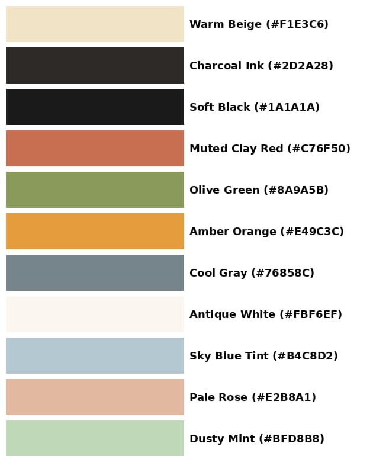
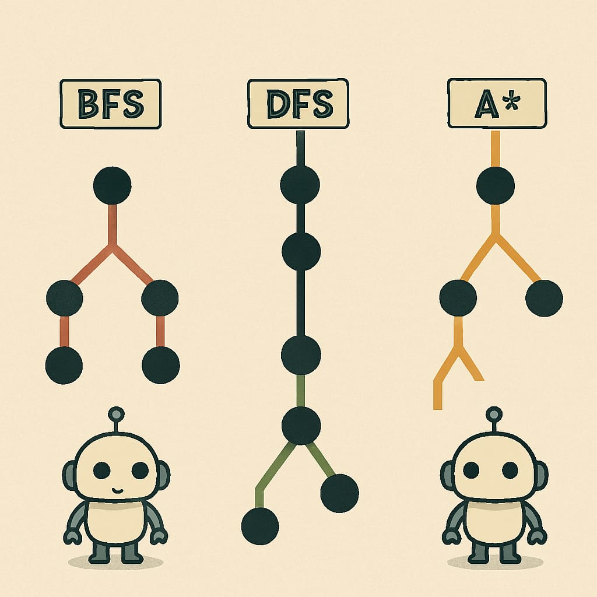

# Blog Style Definitions

## Generating Images

### Palettes

#### Base Palette

For creating images in the blog posts (could be cover or just for other diagrams), this is the base palette:

For example:

##### Primary

TODO: Generalize

| Name            | Hex      | Usage                              |
|-----------------|----------|------------------------------------|
| Warm Beige      | #F1E3C6  | Backgrounds                       |
| Charcoal Ink    | #2D2A28  | Outlines, text, accents           |
| Soft Black      | #1A1A1A  | Nodes, core robot parts           |
| Muted Clay Red  | #C76F50  | BFS lines, highlights             |
| Olive Green     | #8A9A5B  | DFS paths, nature/logic tones     |
| Amber Orange    | #E49C3C  | A* paths, UI highlights           |
| Cool Gray       | #76858C  | Robot joints, shadows             |
| Antique White   | #FBF6EF  | Secondary backgrounds or overlays |

##### Supporting Colors (For UI or Visuals)

| Name           | Hex      | Usage                              |
|----------------|----------|------------------------------------|
| Sky Blue Tint  | #B4C8D2  | Diagrams, buttons, calming accent |
| Pale Rose      | #E2B8A1  | Secondary highlights or graph contrast |
| Dusty Mint     | #BFD8B8  | Light fills, secondary visuals    |

#### Other Palettes

I want each topic to have its own Special Palette, complementing the base palette.
Use the Paleta repo for this (like in my hashnode posts).

### Mascot

`⍴bo` (rho/bo) is the mascot for my blog:

### Prompt Template

TODO: Generalize and improve

(Untested)

*"A 2D digital illustration in a minimalist vintage style, with a warm beige background. It features a small, cute robot mascot with a rounded body (as in the attached image), standing near a simplified diagram or scene that visually represents: "[[YOUR BLOG TOPIC HERE]]". The robot is integrated naturally into the scene, either observing, navigating, or interacting with elements like trees, mazes, or graphs. Use clean shapes, soft shadows, and muted tones like red, green, orange, and blue. The composition should be symmetrical or balanced, without text or title. The overall style should match a retro-technical aesthetic, ideal for a blog cover image."*

> NOTE: In the prompt attach [⍴bo](./images/mascot.jpg) for the result to be more deterministic.

Replace [[YOUR BLOG TOPIC HERE]] with entries like:

- "heuristic-guided pathfinding"
- "real-time vs offline planning"
- "multi-agent coordination strategies"

## Other Tips

**1. Color Palette**
Choose a primary palette (e.g., muted warm tones, like beige, rust, olive, soft blue) and stick with it across:
Blog images
Website background
Accent colors for buttons/links
Diagrams or charts
I can generate a palette for you based on the current mascot image if you'd like.

**2. Typography**
Pick 1–2 fonts:
A clean sans-serif for body text
A quirky or geometric font for headers (optional, if you want a personality-infused look)
Use consistent font sizes, line spacing, and alignment across your blog.

**3. Logo or Wordmark**
Even just your name or alias in a stylized font next to your robot mascot can serve as a lightweight logo. Use it on your site, slides, GitHub, etc.

**4. Layout System**
Define:
How headers, text, and images are laid out (e.g., image left, text right; always include an intro paragraph)
Post length and structure (e.g., always end with a summary or "What’s Next")

**5. Image Prompt Template**
You already have a solid one. Use it consistently to illustrate blog topics.

**6. Mascot Guidelines**
Create a mini guide for using the mascot:
Expression variants (neutral, curious, surprised, etc.)
Positioning (left corner, interacting with diagrams)
Don’ts (e.g., don’t distort it, don’t change its color)

**7. Tone of Voice**
Decide how you write:
Friendly and curious?
Technical and concise?
Analogies and visuals or straight theory?
Keep it consistent across posts and your portfolio pages.
